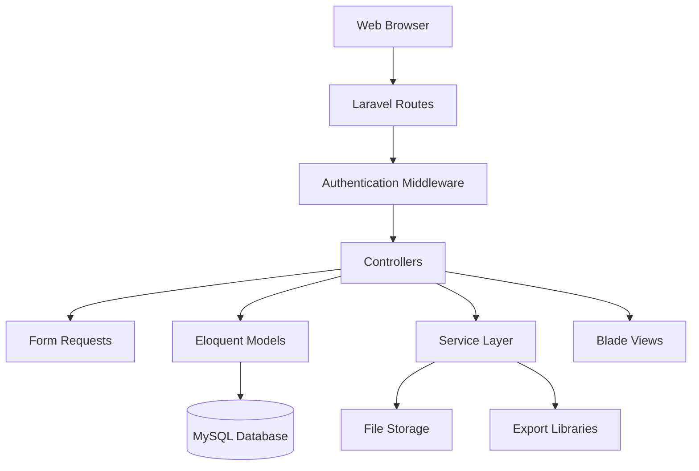

# Design Document

## Overview

The Student Record System is built using Laravel 11.x framework following the MVC (Model-View-Controller) architectural pattern. The system leverages Laravel's built-in features including Eloquent ORM for database operations, Blade templating engine for views, middleware for authentication, and form request validation for data integrity.

The application consists of two primary user-facing modules:
1. **Authentication Module**: Handles administrator login/logout and session management
2. **Student Management Module**: Provides CRUD operations, search, export, dashboard, and activity logging

The design emphasizes clean code principles, separation of concerns, and Laravel best practices to ensure maintainability and extensibility.

## Architecture

### High-Level Architecture



### Layer Responsibilities

**Presentation Layer (Blade Views)**
- Renders HTML using Blade templating engine
- Handles user input through forms
- Displays validation errors and success messages
- Implements responsive design with CSS framework (Bootstrap/Tailwind)
- Manages theme switching (dark/light mode) via JavaScript and local storage

**Application Layer (Controllers)**
- Handles HTTP requests and responses
- Coordinates between models, services, and views
- Manages request flow and business logic orchestration
- Returns appropriate views with data

**Service Layer**
- Encapsulates complex business logic
- Handles file uploads and storage operations
- Manages export functionality (Excel/PDF generation)
- Implements activity logging
- Provides reusable business operations

**Data Layer (Models & Database)**
- Eloquent models represent database entities
- Defines relationships and data access patterns
- Handles database queries through Eloquent ORM
- Manages data persistence and retrieval

**Security Layer (Middleware & Validation)**
- Authentication middleware protects routes
- CSRF protection on all forms
- Form Request classes validate input data
- SQL injection prevention through Eloquent
- XSS prevention through Blade escaping

## Components and Interfaces

### Models

#### Student Model
```php
class Student extends Model
{
    protected $fillable = [
        'student_id',
        'full_name',
        'course',
        'year_level',
        'contact_number',
        'address',
        'photo_path'
    ];
    
    protected $casts = [
        'year_level' => 'integer',
        'created_at' => 'datetime',
        'updated_at' => 'datetime'
    ];
    
    // Relationships
    public function activityLogs();
}
```

#### User Model (Administrator)
```php
class User extends Authenticatable
{
    protected $fillable = ['name', 'email', 'password'];
    protected $hidden = ['password', 'remember_token'];
    
    // Relationships
    public function activityLogs();
}
```

#### ActivityLog Model
```php
class ActivityLog extends Model
{
    protected $fillable = [
        'user_id',
        'action_type',
        'student_id',
        'record_details',
        'changed_fields'
    ];
    
    protected $casts = [
        'record_details' => 'array',
        'changed_fields' => 'array',
        'created_at' => 'datetime'
    ];
    
    // Relationships
    public function user();
    public function student();
}
```

### Controllers

#### AuthController
- `showLoginForm()`: Display login page
- `login(LoginRequest $request)`: Authenticate administrator
- `logout()`: Terminate session and redirect

#### StudentController
- `index(Request $request)`: List students with pagination and search
- `create()`: Show student creation form
- `store(StoreStudentRequest $request)`: Create new student record
- `show(Student $student)`: Display student details
- `edit(Student $student)`: Show edit form
- `update(UpdateStudentRequest $request, Student $student)`: Update student
- `destroy(Student $student)`: Delete student record

#### DashboardController
- `index()`: Display dashboard with statistics

#### ExportController
- `exportExcel(Request $request)`: Generate Excel file
- `exportPdf(Request $request)`: Generate PDF document

#### ActivityLogController
- `index()`: Display activity logs with pagination

### Form Requests

#### StoreStudentRequest
```php
public function rules()
{
    return [
        'student_id' => 'required|unique:students|alpha_num|min:5|max:20',
        'full_name' => 'required|string|regex:/^[a-zA-Z\s]+$/|min:2|max:100',
        'course' => 'required|string|regex:/^[a-zA-Z\s]+$/|min:2|max:100',
        'year_level' => 'required|integer|between:1,6',
        'contact_number' => 'nullable|numeric|digits_between:10,15',
        'address' => 'nullable|string|min:5|max:255',
        'photo' => 'nullable|image|mimes:jpeg,png,gif|max:2048'
    ];
}
```

#### UpdateStudentRequest
```php
public function rules()
{
    return [
        'student_id' => 'required|alpha_num|min:5|max:20|unique:students,student_id,' . $this->student->id,
        'full_name' => 'required|string|regex:/^[a-zA-Z\s]+$/|min:2|max:100',
        'course' => 'required|string|regex:/^[a-zA-Z\s]+$/|min:2|max:100',
        'year_level' => 'required|integer|between:1,6',
        'contact_number' => 'nullable|numeric|digits_between:10,15',
        'address' => 'nullable|string|min:5|max:255',
        'photo' => 'nullable|image|mimes:jpeg,png,gif|max:2048'
    ];
}
```

### Services

#### FileUploadService
- `uploadPhoto(UploadedFile $file, ?string $oldPath = null)`: Handle photo upload
- `deletePhoto(string $path)`: Remove photo file
- `getPhotoUrl(string $path)`: Generate public URL

#### ExportService
- `exportToExcel(Collection $students)`: Generate Excel file using Laravel Excel
- `exportToPdf(Collection $students)`: Generate PDF using DomPDF or similar

#### ActivityLogService
- `logCreate(User $user, Student $student)`: Log creation action
- `logUpdate(User $user, Student $student, array $changes)`: Log update action
- `logDelete(User $user, Student $student)`: Log deletion action

### Routes

```php
// Authentication routes
Route::get('/login', [AuthController::class, 'showLoginForm'])->name('login');
Route::post('/login', [AuthController::class, 'login']);
Route::post('/logout', [AuthController::class, 'logout'])->name('logout');

// Protected routes (require authentication)
Route::middleware(['auth'])->group(function () {
    Route::get('/dashboard', [DashboardController::class, 'index'])->name('dashboard');
    Route::resource('students', StudentController::class);
    Route::get('/students/export/excel', [ExportController::class, 'exportExcel'])->name('students.export.excel');
    Route::get('/students/export/pdf', [ExportController::class, 'exportPdf'])->name('students.export.pdf');
    Route::get('/activity-logs', [ActivityLogController::class, 'index'])->name('activity-logs.index');
});
```

## Data Models

### Database Schema

#### students table
```sql
CREATE TABLE students (
    id BIGINT UNSIGNED AUTO_INCREMENT PRIMARY KEY,
    student_id VARCHAR(20) UNIQUE NOT NULL,
    full_name VARCHAR(100) NOT NULL,
    course VARCHAR(100) NOT NULL,
    year_level TINYINT NOT NULL,
    contact_number VARCHAR(15) NULL,
    address VARCHAR(255) NULL,
    photo_path VARCHAR(255) NULL,
    created_at TIMESTAMP NULL,
    updated_at TIMESTAMP NULL,
    INDEX idx_student_id (student_id),
    INDEX idx_full_name (full_name),
    INDEX idx_course (course),
    INDEX idx_year_level (year_level)
);
```

#### users table
```sql
CREATE TABLE users (
    id BIGINT UNSIGNED AUTO_INCREMENT PRIMARY KEY,
    name VARCHAR(255) NOT NULL,
    email VARCHAR(255) UNIQUE NOT NULL,
    password VARCHAR(255) NOT NULL,
    remember_token VARCHAR(100) NULL,
    created_at TIMESTAMP NULL,
    updated_at TIMESTAMP NULL
);
```

#### activity_logs table
```sql
CREATE TABLE activity_logs (
    id BIGINT UNSIGNED AUTO_INCREMENT PRIMARY KEY,
    user_id BIGINT UNSIGNED NOT NULL,
    action_type ENUM('create', 'update', 'delete') NOT NULL,
    student_id BIGINT UNSIGNED NULL,
    record_details JSON NULL,
    changed_fields JSON NULL,
    created_at TIMESTAMP NULL,
    FOREIGN KEY (user_id) REFERENCES users(id) ON DELETE CASCADE,
    FOREIGN KEY (student_id) REFERENCES students(id) ON DELETE SET NULL,
    INDEX idx_user_id (user_id),
    INDEX idx_action_type (action_type),
    INDEX idx_created_at (created_at)
);
```

### Data Relationships

- **User (1) → (Many) ActivityLog**: One administrator can perform many actions
- **Student (1) → (Many) ActivityLog**: One student can have many log entries
- **Student (1) → (1) Photo**: One student has one optional photo file


## Correctness Properties

*A property is a characteristic or behavior that should hold true across all valid executions of a system—essentially, a formal statement about what the system should do. Properties serve as the bridge between human-readable specifications and machine-verifiable correctness guarantees.*

### Property 1: Student creation persistence
*For any* valid student data (with required fields: student_id, full_name, course, year_level), after creating a student record, querying the database should return a record with the same data.
**Validates: Requirements 1.1, 1.5**

### Property 2: Invalid student rejection
*For any* student data missing one or more required fields (student_id, full_name, course, year_level), attempting to create a student record should be rejected with validation errors.
**Validates: Requirements 1.2**

### Property 3: Duplicate student ID prevention
*For any* existing student record, attempting to create another student with the same student_id should be rejected with a uniqueness error.
**Validates: Requirements 1.3**

### Property 4: Student list completeness
*For any* set of students in the database, the student list view should display all students across paginated pages.
**Validates: Requirements 2.1**

### Property 5: Student list field display
*For any* student in the list view, the rendered HTML should contain the student's full_name, student_id, course, and year_level.
**Validates: Requirements 2.3**

### Property 6: Student detail completeness
*For any* student record, the detail view should display all six fields: full_name, student_id, course, year_level, contact_number, and address.
**Validates: Requirements 3.1, 3.3**

### Property 7: Student detail navigation elements
*For any* student detail page, the rendered HTML should contain edit and delete action buttons.
**Validates: Requirements 3.4**

### Property 8: Student update persistence
*For any* existing student and any valid modified data, after updating the student, querying the database should return the updated data.
**Validates: Requirements 4.1, 4.3**

### Property 9: Invalid update rejection
*For any* student update with invalid data (violating validation rules), the update should be rejected with validation errors.
**Validates: Requirements 4.2**

### Property 10: Timestamp preservation on update
*For any* student update, the created_at timestamp should remain unchanged while the updated_at timestamp should be modified.
**Validates: Requirements 4.4**

### Property 11: Student deletion completeness
*For any* existing student, after deletion, querying the database for that student should return no results.
**Validates: Requirements 5.1**

### Property 12: Form data preservation on validation failure
*For any* invalid form submission, the form should be re-rendered with the previously submitted data preserved in the input fields.
**Validates: Requirements 6.2**

### Property 13: Full name validation enforcement
*For any* full_name value that doesn't match the pattern (alphabetic characters and spaces, 2-100 characters), validation should reject it.
**Validates: Requirements 6.3**

### Property 14: Student ID validation enforcement
*For any* student_id value that doesn't match the pattern (alphanumeric, 5-20 characters), validation should reject it.
**Validates: Requirements 6.4**

### Property 15: Course validation enforcement
*For any* course value that doesn't match the pattern (alphabetic characters and spaces, 2-100 characters), validation should reject it.
**Validates: Requirements 6.5**

### Property 16: Year level validation enforcement
*For any* year_level value outside the range 1-6, validation should reject it.
**Validates: Requirements 6.6**

### Property 17: Contact number validation enforcement
*For any* provided contact_number that doesn't match the pattern (numeric, 10-15 digits), validation should reject it.
**Validates: Requirements 6.7**

### Property 18: Address validation enforcement
*For any* provided address that doesn't meet the requirements (alphanumeric, 5-255 characters), validation should reject it.
**Validates: Requirements 6.8**

### Property 19: Search result accuracy
*For any* search query and database state, all returned results should contain the query string in at least one of these fields: full_name, student_id, course, or year_level.
**Validates: Requirements 7.1**

### Property 20: Search clear restoration
*For any* database state, after performing a search and then clearing it, the student list should display all students again.
**Validates: Requirements 7.4**

### Property 21: Validation error field association
*For any* form submission with validation errors, each error message should be associated with the specific field that failed validation.
**Validates: Requirements 8.3**

### Property 22: CSRF token validation
*For any* form submission without a valid CSRF token, the request should be rejected with a 419 error.
**Validates: Requirements 9.1**

### Property 23: HTML entity escaping
*For any* user-provided input containing HTML tags, when displayed in a view, the HTML should be escaped (not rendered as HTML).
**Validates: Requirements 9.3**

### Property 24: Authentication requirement
*For any* protected route (student management pages), accessing without authentication should redirect to the login page.
**Validates: Requirements 10.1**

### Property 25: Valid login success
*For any* valid administrator credentials, submitting them to the login form should authenticate the user and create a session.
**Validates: Requirements 10.2**

### Property 26: Invalid login rejection
*For any* invalid administrator credentials, submitting them to the login form should reject the login and display an error.
**Validates: Requirements 10.3**

### Property 27: Logout session termination
*For any* authenticated administrator, after logging out, the session should be terminated and subsequent requests should require re-authentication.
**Validates: Requirements 10.4**

### Property 28: Navigation consistency
*For any* page in the application, the rendered HTML should contain the same navigation structure.
**Validates: Requirements 11.1**

### Property 29: Form label completeness
*For any* form in the application, all input fields should have associated label elements.
**Validates: Requirements 11.2**

### Property 30: Photo upload field presence
*For any* student create or edit form, the rendered HTML should contain a file input field for photo upload.
**Validates: Requirements 12.1**

### Property 31: Photo file validation
*For any* uploaded file that is not an image (JPEG, PNG, GIF) or exceeds 2MB, validation should reject it.
**Validates: Requirements 12.2**

### Property 32: Photo storage persistence
*For any* valid photo upload, the file should exist in the storage directory and the file path should be saved in the database.
**Validates: Requirements 12.3**

### Property 33: Photo display in detail view
*For any* student with a photo_path, the detail view should contain an img element with the photo URL.
**Validates: Requirements 12.4**

### Property 34: Default photo placeholder
*For any* student without a photo_path, the detail view should display a default placeholder image.
**Validates: Requirements 12.5**

### Property 35: Excel export completeness
*For any* set of visible students, the exported Excel file should contain rows for all students with all six data fields.
**Validates: Requirements 13.1**

### Property 36: PDF export completeness
*For any* set of visible students, the exported PDF should contain all students with all six data fields.
**Validates: Requirements 13.2**

### Property 37: Export filter respect
*For any* search query, the exported file should contain only students matching the search criteria.
**Validates: Requirements 13.3**

### Property 38: Export column headers
*For any* export (Excel or PDF), the file should include column headers for all six fields.
**Validates: Requirements 13.5**

### Property 39: Dashboard total count accuracy
*For any* database state, the dashboard should display the correct total count of students.
**Validates: Requirements 14.1**

### Property 40: Dashboard year level grouping accuracy
*For any* database state, the dashboard should display accurate counts of students grouped by year_level.
**Validates: Requirements 14.2**

### Property 41: Dashboard course grouping accuracy
*For any* database state, the dashboard should display accurate counts of students grouped by course.
**Validates: Requirements 14.3**

### Property 42: Activity log creation on student create
*For any* student creation, an activity log entry should be created with action_type='create', the administrator's ID, and the student's details.
**Validates: Requirements 15.1**

### Property 43: Activity log creation on student update
*For any* student update, an activity log entry should be created with action_type='update', the administrator's ID, the student ID, and the changed fields.
**Validates: Requirements 15.2**

### Property 44: Activity log creation on student delete
*For any* student deletion, an activity log entry should be created with action_type='delete', the administrator's ID, and the deleted student's details.
**Validates: Requirements 15.3**

### Property 45: Activity log chronological ordering
*For any* set of activity logs, the activity log page should display them in reverse chronological order (newest first).
**Validates: Requirements 15.4**

### Property 46: Activity log field completeness
*For any* activity log entry, the display should include action_type, timestamp, administrator name, and student identifier.
**Validates: Requirements 15.5**

### Property 47: Theme preference persistence
*For any* theme selection (dark or light), the preference should be saved to browser local storage.
**Validates: Requirements 16.2**

### Property 48: Theme preference round-trip
*For any* theme preference saved to local storage, when the user returns to the application, the same theme should be loaded.
**Validates: Requirements 16.3**

## Error Handling

### Validation Errors
- All form requests use Laravel's Form Request validation
- Validation errors are automatically returned to the form with old input preserved
- Error messages are displayed using Blade's `@error` directive
- Custom error messages provide clear, user-friendly feedback

### Database Errors
- Database exceptions are caught in controllers
- Generic error messages are shown to users (no technical details exposed)
- Detailed errors are logged to Laravel's log files
- Transaction rollbacks ensure data consistency

### File Upload Errors
- File validation occurs before storage operations
- Failed uploads return validation errors
- Orphaned files are cleaned up if database operations fail
- Storage exceptions are caught and logged

### Authentication Errors
- Invalid credentials return to login form with error message
- Session expiration redirects to login with informational message
- CSRF token mismatches return 419 error page
- Unauthorized access attempts are logged

### 404 Errors
- Non-existent student records return 404 with custom error page
- Custom 404 page provides navigation back to student list
- Invalid routes handled by Laravel's default 404 handler

## Testing Strategy

### Unit Testing

The application will use PHPUnit (Laravel's default testing framework) for unit tests. Unit tests will focus on:

**Model Tests**
- Test model relationships (User → ActivityLog, Student → ActivityLog)
- Test model attribute casting
- Test model fillable/guarded attributes

**Validation Tests**
- Test Form Request validation rules with specific examples
- Test edge cases: boundary values (min/max lengths), empty strings, special characters
- Test unique constraint on student_id
- Test optional field validation (contact_number, address)

**Service Tests**
- Test FileUploadService with sample image files
- Test ExportService with sample student data
- Test ActivityLogService logging methods

**Controller Tests**
- Test HTTP responses (status codes, redirects)
- Test authentication middleware protection
- Test CSRF protection

### Property-Based Testing

The application will use **Pest PHP with Pest Property Testing plugin** for property-based tests. Each property-based test will run a minimum of 100 iterations with randomly generated data.

**Property Test Implementation Requirements:**
- Each property-based test must be tagged with a comment referencing the design document property
- Tag format: `// Feature: student-record-system, Property {number}: {property_text}`
- Each correctness property must be implemented by a single property-based test
- Property tests should be placed as close to implementation as possible to catch errors early

**Data Generators:**
- Valid student data generator (with all required fields)
- Invalid student data generator (missing required fields, invalid formats)
- Random string generators for names, courses, addresses
- Random numeric generators for year_level, contact_number
- Random alphanumeric generator for student_id
- File upload generators (valid images, invalid files)

**Property Test Coverage:**
- CRUD operations (create, read, update, delete)
- Validation rules for all fields
- Search functionality
- Authentication and authorization
- File upload and storage
- Export functionality
- Dashboard statistics
- Activity logging
- Theme preferences

### Integration Testing

Integration tests will verify end-to-end workflows:
- Complete student lifecycle (create → view → update → delete)
- Authentication flow (login → access protected routes → logout)
- Search and filter workflow
- Export workflow with filtered results
- Photo upload and display workflow

### Browser Testing (Optional)

Laravel Dusk can be used for browser tests to verify:
- JavaScript functionality (theme toggle, confirmation dialogs)
- Responsive design at different viewport sizes
- Form interactions and validation display
- Pagination navigation

## Code Quality Standards

### Clean Code Principles

**Naming Conventions**
- Controllers: Singular noun + "Controller" (e.g., `StudentController`)
- Models: Singular noun (e.g., `Student`, `ActivityLog`)
- Methods: Descriptive verb phrases (e.g., `uploadPhoto`, `logCreate`)
- Variables: Descriptive nouns (e.g., `$student`, `$validatedData`)
- Routes: RESTful naming (e.g., `students.index`, `students.store`)

**Single Responsibility**
- Controllers handle HTTP request/response only
- Services encapsulate complex business logic
- Models handle data access and relationships
- Form Requests handle validation logic
- Blade views handle presentation only

**DRY (Don't Repeat Yourself)**
- Reusable Blade components for common UI elements (forms, tables, buttons)
- Service classes for shared business logic
- Traits for shared model behaviors
- Helper functions for common operations

**Comments and Documentation**
- PHPDoc blocks for all public methods
- Inline comments for complex business logic
- README documentation for setup and deployment
- API documentation for any exposed endpoints

### Laravel Best Practices

- Use Eloquent ORM instead of raw queries
- Use Form Requests for validation
- Use Resource Controllers for RESTful operations
- Use Blade components and layouts for views
- Use middleware for cross-cutting concerns
- Use service providers for dependency injection
- Use migrations for database schema
- Use seeders for test data
- Use factories for model generation
- Follow PSR-12 coding standards

### Security Best Practices

- Never store passwords in plain text (use bcrypt)
- Always validate and sanitize user input
- Use CSRF protection on all forms
- Use parameterized queries (Eloquent handles this)
- Escape output in Blade templates (use `{{ }}` not `{!! !!}`)
- Implement proper authentication and authorization
- Keep dependencies updated
- Use environment variables for sensitive configuration
- Implement rate limiting on authentication routes

## Performance Considerations

### Database Optimization
- Index frequently queried columns (student_id, full_name, course, year_level)
- Use eager loading to prevent N+1 queries
- Implement database query caching for dashboard statistics
- Use pagination to limit result sets

### File Storage
- Store uploaded photos in Laravel's storage directory
- Use symbolic links for public access
- Implement file size limits to prevent storage abuse
- Consider cloud storage (S3) for production scalability

### Caching Strategy
- Cache dashboard statistics (invalidate on student create/update/delete)
- Cache activity log counts
- Use Laravel's cache facade with appropriate TTL values

### Frontend Optimization
- Minify CSS and JavaScript assets
- Use Laravel Mix for asset compilation
- Implement lazy loading for images
- Use CDN for CSS frameworks (Bootstrap/Tailwind)

## Deployment Considerations

### Environment Configuration
- Separate .env files for development, staging, production
- Use queue workers for background jobs (if implemented)
- Configure proper session and cache drivers
- Set appropriate file permissions

### Database Setup
- Run migrations on deployment
- Seed initial administrator account
- Configure database backups
- Set up database connection pooling

### Security Hardening
- Disable debug mode in production
- Configure HTTPS/SSL
- Set secure session cookies
- Implement rate limiting
- Configure CORS if needed

### Monitoring and Logging
- Configure Laravel's logging channels
- Monitor application errors
- Track performance metrics
- Set up alerts for critical errors
